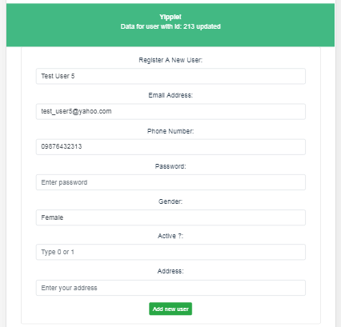

# fronttrans

## Project setup
```
npm install
```

### Compiles and hot-reloads for development
```
npm run serve
```

### Compiles and minifies for production
```
npm run build
```

### Live
Deploy to netlify. See [this](https://sad-ritchie-735483.netlify.com/)

### Print screen

